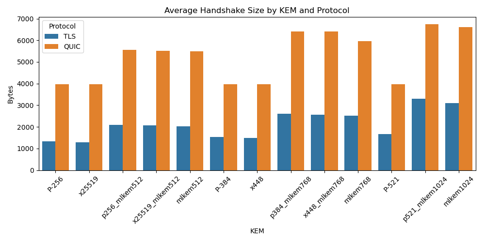

# Full Handshake Performance Analysis in TLS and QUIC

## Level 1 — Protocol TLS

### Summary Statistics by KEM

| KEM | Type | Mean | Median | Std | Min | Max | Size (bytes) |
|-----|------|------|--------|-----|-----|-----|---------------|
`P-256` | Traditional | 5.17 | 5.49 | 1.42 | 2.08 | 20.78 | 1327
`mlkem512` | Post-quantum | 5.10 | 5.30 | 1.07 | 2.05 | 7.91 | 2030
`p256_mlkem512` | Hybrid | 21.83 | 22.38 | 3.49 | 9.47 | 29.10 | 2095
`x25519` | Traditional | 4.67 | 5.08 | 1.20 | 1.99 | 8.09 | 1294
`x25519_mlkem512` | Hybrid | 5.90 | 6.30 | 1.29 | 2.46 | 8.63 | 2062
- Shapiro-Wilk for Traditional: p = 0.0000
- Shapiro-Wilk for Hybrid: p = 0.0000
- Shapiro-Wilk for Post-quantum: p = 0.0000
- Levene’s Test for homogeneity: p = 0.0000
- T-test between Traditional and Hybrid: p = 0.0000 (unequal var)
- T-test between Traditional and Post-quantum: p = 0.0053 (unequal var)
- T-test between Hybrid and Post-quantum: p = 0.0000 (unequal var)

## Level 1 — Protocol QUIC

### Summary Statistics by KEM

| KEM | Type | Mean | Median | Std | Min | Max | Size (bytes) |
|-----|------|------|--------|-----|-----|-----|---------------|
`P-256` | Traditional | 3.31 | 2.96 | 1.23 | 2.60 | 26.64 | 3963
`mlkem512` | Post-quantum | 2.52 | 2.42 | 0.27 | 2.18 | 3.98 | 5485
`p256_mlkem512` | Hybrid | 16.22 | 14.70 | 3.82 | 11.92 | 30.53 | 5550
`x25519` | Traditional | 2.90 | 2.60 | 0.57 | 2.31 | 5.99 | 3963
`x25519_mlkem512` | Hybrid | 5.04 | 4.67 | 0.74 | 4.25 | 9.64 | 5517
- Shapiro-Wilk for Traditional: p = 0.0000
- Shapiro-Wilk for Hybrid: p = 0.0000
- Shapiro-Wilk for Post-quantum: p = 0.0000
- Levene’s Test for homogeneity: p = 0.0000
- T-test between Traditional and Hybrid: p = 0.0000 (unequal var)
- T-test between Traditional and Post-quantum: p = 0.0000 (unequal var)
- T-test between Hybrid and Post-quantum: p = 0.0000 (unequal var)

## Level 3 — Protocol TLS

### Summary Statistics by KEM

| KEM | Type | Mean | Median | Std | Min | Max | Size (bytes) |
|-----|------|------|--------|-----|-----|-----|---------------|
`P-384` | Traditional | 26.99 | 26.83 | 2.28 | 13.17 | 34.49 | 1523
`mlkem768` | Post-quantum | 13.94 | 14.43 | 2.23 | 5.75 | 26.95 | 2513
`p384_mlkem768` | Hybrid | 44.09 | 45.69 | 6.19 | 20.44 | 58.33 | 2611
`x448` | Traditional | 16.25 | 16.80 | 2.07 | 7.56 | 24.32 | 1482
`x448_mlkem768` | Hybrid | 19.01 | 18.84 | 1.62 | 8.19 | 25.52 | 2570
- Shapiro-Wilk for Traditional: p = 0.0000
- Shapiro-Wilk for Hybrid: p = 0.0000
- Shapiro-Wilk for Post-quantum: p = 0.0000
- Levene’s Test for homogeneity: p = 0.0000
- T-test between Traditional and Hybrid: p = 0.0000 (unequal var)
- T-test between Traditional and Post-quantum: p = 0.0000 (unequal var)
- T-test between Hybrid and Post-quantum: p = 0.0000 (unequal var)

## Level 3 — Protocol QUIC

### Summary Statistics by KEM

| KEM | Type | Mean | Median | Std | Min | Max | Size (bytes) |
|-----|------|------|--------|-----|-----|-----|---------------|
`P-384` | Traditional | 7.95 | 7.41 | 1.14 | 7.07 | 12.07 | 3963
`mlkem768` | Post-quantum | 5.00 | 4.62 | 0.80 | 4.22 | 8.00 | 5950
`p384_mlkem768` | Hybrid | 18.98 | 17.46 | 3.22 | 16.53 | 31.59 | 6403
`x448` | Traditional | 5.80 | 5.37 | 0.93 | 5.06 | 9.96 | 3963
`x448_mlkem768` | Hybrid | 9.71 | 9.25 | 1.45 | 8.18 | 14.28 | 6403
- Shapiro-Wilk for Traditional: p = 0.0000
- Shapiro-Wilk for Hybrid: p = 0.0000
- Shapiro-Wilk for Post-quantum: p = 0.0000
- Levene’s Test for homogeneity: p = 0.0000
- T-test between Traditional and Hybrid: p = 0.0000 (unequal var)
- T-test between Traditional and Post-quantum: p = 0.0000 (unequal var)
- T-test between Hybrid and Post-quantum: p = 0.0000 (unequal var)

## Level 5 — Protocol TLS

### Summary Statistics by KEM

| KEM | Type | Mean | Median | Std | Min | Max | Size (bytes) |
|-----|------|------|--------|-----|-----|-----|---------------|
`P-521` | Traditional | 50.56 | 52.12 | 7.91 | 22.69 | 74.45 | 1668
`mlkem1024` | Post-quantum | 25.57 | 25.34 | 2.81 | 11.21 | 43.20 | 3104
`p521_mlkem1024` | Hybrid | 69.70 | 72.49 | 11.64 | 32.85 | 121.06 | 3303
- Shapiro-Wilk for Traditional: p = 0.0000
- Shapiro-Wilk for Hybrid: p = 0.0000
- Shapiro-Wilk for Post-quantum: p = 0.0000
- Levene’s Test for homogeneity: p = 0.0000
- T-test between Traditional and Hybrid: p = 0.0000 (unequal var)
- T-test between Traditional and Post-quantum: p = 0.0000 (unequal var)
- T-test between Hybrid and Post-quantum: p = 0.0000 (unequal var)

## Level 5 — Protocol QUIC

### Summary Statistics by KEM

| KEM | Type | Mean | Median | Std | Min | Max | Size (bytes) |
|-----|------|------|--------|-----|-----|-----|---------------|
`P-521` | Traditional | 8.39 | 7.74 | 1.28 | 7.17 | 12.43 | 3963
`mlkem1024` | Post-quantum | 5.33 | 4.93 | 0.87 | 4.48 | 8.91 | 6603
`p521_mlkem1024` | Hybrid | 20.30 | 18.70 | 3.48 | 17.19 | 37.33 | 6735
- Shapiro-Wilk for Traditional: p = 0.0000
- Shapiro-Wilk for Hybrid: p = 0.0000
- Shapiro-Wilk for Post-quantum: p = 0.0000
- Levene’s Test for homogeneity: p = 0.0000
- T-test between Traditional and Hybrid: p = 0.0000 (unequal var)
- T-test between Traditional and Post-quantum: p = 0.0000 (unequal var)
- T-test between Hybrid and Post-quantum: p = 0.0000 (unequal var)

# Summary by Protocol and Level (excluding >1000 ms)

| Protocol | Level | Mean | Std | CV | % Outliers |
|----------|:-----:|-----:|----:|---:|-----------:|
QUIC | 1 | 6.00 | 5.50 | 0.92 | 20.04%
QUIC | 3 | 9.49 | 5.32 | 0.56 | 5.88%
QUIC | 5 | 11.34 | 6.82 | 0.60 | 0.07%
TLS | 1 | 8.53 | 6.93 | 0.81 | 22.84%
TLS | 3 | 24.06 | 11.44 | 0.48 | 6.64%
TLS | 5 | 48.61 | 19.88 | 0.41 | 0.00%

# Detail by Protocol, Level and KEM (excluding >1000 ms)

| Protocol | Level | KEM | Mean | Std | CV | % Outliers | Shapiro p | Levene p |
|----------|:-----:|:----|-----:|----:|---:|-----------:|----------:|---------:|
QUIC | 1 | `P-256` | 3.31 | 1.23 | 0.37 | 2.40% | 1.25e-38 | 3.12e-275
QUIC | 1 | `mlkem512` | 2.52 | 0.27 | 0.11 | 16.20% | 2.30e-26 | 3.12e-275
QUIC | 1 | `p256_mlkem512` | 16.22 | 3.82 | 0.24 | 0.20% | 7.48e-20 | 3.12e-275
QUIC | 1 | `x25519` | 2.90 | 0.57 | 0.20 | 3.60% | 1.10e-23 | 3.12e-275
QUIC | 1 | `x25519_mlkem512` | 5.04 | 0.74 | 0.15 | 1.40% | 5.56e-25 | 3.12e-275
QUIC | 3 | `P-384` | 7.95 | 1.14 | 0.14 | 21.20% | 1.55e-30 | 2.94e-49
QUIC | 3 | `mlkem768` | 5.00 | 0.80 | 0.16 | 9.40% | 8.10e-25 | 2.94e-49
QUIC | 3 | `p384_mlkem768` | 18.98 | 3.22 | 0.17 | 12.80% | 3.85e-30 | 2.94e-49
QUIC | 3 | `x448` | 5.80 | 0.93 | 0.16 | 21.80% | 2.78e-30 | 2.94e-49
QUIC | 3 | `x448_mlkem768` | 9.71 | 1.45 | 0.15 | 4.80% | 3.79e-22 | 2.94e-49
QUIC | 5 | `P-521` | 8.39 | 1.28 | 0.15 | 12.40% | 3.34e-25 | 8.91e-44
QUIC | 5 | `mlkem1024` | 5.33 | 0.87 | 0.16 | 10.60% | 1.06e-24 | 8.91e-44
QUIC | 5 | `p521_mlkem1024` | 20.30 | 3.48 | 0.17 | 13.60% | 7.47e-27 | 8.91e-44
TLS | 1 | `P-256` | 5.17 | 1.42 | 0.28 | 15.40% | 5.54e-26 | 3.41e-55
TLS | 1 | `mlkem512` | 5.10 | 1.07 | 0.21 | 11.40% | 3.88e-17 | 3.41e-55
TLS | 1 | `p256_mlkem512` | 21.83 | 3.49 | 0.16 | 11.20% | 4.04e-27 | 3.41e-55
TLS | 1 | `x25519` | 4.67 | 1.20 | 0.26 | 0.20% | 6.99e-19 | 3.41e-55
TLS | 1 | `x25519_mlkem512` | 5.90 | 1.29 | 0.22 | 17.20% | 6.12e-23 | 3.41e-55
TLS | 3 | `P-384` | 26.99 | 2.28 | 0.08 | 3.40% | 4.22e-25 | 2.45e-49
TLS | 3 | `mlkem768` | 13.94 | 2.23 | 0.16 | 10.60% | 6.33e-26 | 2.45e-49
TLS | 3 | `p384_mlkem768` | 44.09 | 6.19 | 0.14 | 13.00% | 6.32e-27 | 2.45e-49
TLS | 3 | `x448` | 16.25 | 2.07 | 0.13 | 8.60% | 8.23e-24 | 2.45e-49
TLS | 3 | `x448_mlkem768` | 19.01 | 1.62 | 0.09 | 3.60% | 1.73e-23 | 2.45e-49
TLS | 5 | `P-521` | 50.56 | 7.91 | 0.16 | 11.40% | 3.01e-27 | 3.50e-23
TLS | 5 | `mlkem1024` | 25.57 | 2.81 | 0.11 | 4.60% | 2.01e-28 | 3.50e-23
TLS | 5 | `p521_mlkem1024` | 69.70 | 11.64 | 0.17 | 12.80% | 5.33e-30 | 3.50e-23

# Pairwise Welch’s t-test (excluding >1000 ms)

| Protocol | Level | KEM1 | KEM2 | Welch’s p-value |
|----------|:-----:|:----:|:----:|----------------:|
QUIC | 1 | `P-256` | `mlkem512` | 6.79e-39
QUIC | 1 | `P-256` | `p256_mlkem512` | 4.41e-297
QUIC | 1 | `P-256` | `x25519` | 1.31e-11
QUIC | 1 | `P-256` | `x25519_mlkem512` | 1.53e-115
QUIC | 1 | `mlkem512` | `p256_mlkem512` | 2.58e-288
QUIC | 1 | `mlkem512` | `x25519` | 4.23e-36
QUIC | 1 | `mlkem512` | `x25519_mlkem512` | 4.97e-306
QUIC | 1 | `p256_mlkem512` | `x25519` | 4.57e-287
QUIC | 1 | `p256_mlkem512` | `x25519_mlkem512` | 1.12e-253
QUIC | 1 | `x25519` | `x25519_mlkem512` | 1.91e-275
QUIC | 3 | `P-384` | `mlkem768` | 6.75e-247
QUIC | 3 | `P-384` | `p384_mlkem768` | 3.30e-304
QUIC | 3 | `P-384` | `x448` | 3.23e-158
QUIC | 3 | `P-384` | `x448_mlkem768` | 9.12e-83
QUIC | 3 | `mlkem768` | `p384_mlkem768` | 0.00e+00
QUIC | 3 | `mlkem768` | `x448` | 4.82e-44
QUIC | 3 | `mlkem768` | `x448_mlkem768` | 1.80e-310
QUIC | 3 | `p384_mlkem768` | `x448` | 0.00e+00
QUIC | 3 | `p384_mlkem768` | `x448_mlkem768` | 6.72e-271
QUIC | 3 | `x448` | `x448_mlkem768` | 1.40e-259
QUIC | 5 | `P-521` | `mlkem1024` | 6.41e-225
QUIC | 5 | `P-521` | `p521_mlkem1024` | 2.38e-306
QUIC | 5 | `mlkem1024` | `p521_mlkem1024` | 0.00e+00
TLS | 1 | `P-256` | `mlkem512` | 3.87e-01
TLS | 1 | `P-256` | `p256_mlkem512` | 0.00e+00
TLS | 1 | `P-256` | `x25519` | 4.25e-09
TLS | 1 | `P-256` | `x25519_mlkem512` | 4.65e-17
TLS | 1 | `mlkem512` | `p256_mlkem512` | 0.00e+00
TLS | 1 | `mlkem512` | `x25519` | 4.62e-09
TLS | 1 | `mlkem512` | `x25519_mlkem512` | 1.94e-25
TLS | 1 | `p256_mlkem512` | `x25519` | 0.00e+00
TLS | 1 | `p256_mlkem512` | `x25519_mlkem512` | 0.00e+00
TLS | 1 | `x25519` | `x25519_mlkem512` | 4.64e-49
TLS | 3 | `P-384` | `mlkem768` | 0.00e+00
TLS | 3 | `P-384` | `p384_mlkem768` | 2.81e-255
TLS | 3 | `P-384` | `x448` | 0.00e+00
TLS | 3 | `P-384` | `x448_mlkem768` | 0.00e+00
TLS | 3 | `mlkem768` | `p384_mlkem768` | 0.00e+00
TLS | 3 | `mlkem768` | `x448` | 6.81e-57
TLS | 3 | `mlkem768` | `x448_mlkem768` | 1.60e-209
TLS | 3 | `p384_mlkem768` | `x448` | 0.00e+00
TLS | 3 | `p384_mlkem768` | `x448_mlkem768` | 0.00e+00
TLS | 3 | `x448` | `x448_mlkem768` | 3.98e-96
TLS | 5 | `P-521` | `mlkem1024` | 3.08e-285
TLS | 5 | `P-521` | `p521_mlkem1024` | 1.91e-139
TLS | 5 | `mlkem1024` | `p521_mlkem1024` | 3.10e-314

# TLS vs QUIC Comparison

- Level 1 — Traditional: TLS mean = 4.92, QUIC mean = 3.10, p = 0.0000
- Level 1 — Hybrid: TLS mean = 13.86, QUIC mean = 10.63, p = 0.0000
- Level 1 — Post-quantum: TLS mean = 5.10, QUIC mean = 2.52, p = 0.0000
- Level 3 — Traditional: TLS mean = 21.62, QUIC mean = 6.88, p = 0.0000
- Level 3 — Hybrid: TLS mean = 31.55, QUIC mean = 14.34, p = 0.0000
- Level 3 — Post-quantum: TLS mean = 13.94, QUIC mean = 5.00, p = 0.0000
- Level 5 — Traditional: TLS mean = 50.56, QUIC mean = 8.39, p = 0.0000
- Level 5 — Hybrid: TLS mean = 69.70, QUIC mean = 20.30, p = 0.0000
- Level 5 — Post-quantum: TLS mean = 25.57, QUIC mean = 5.33, p = 0.0000

# Time vs Size Ratio

| Level | Protocol | Type | Mean Ratio (ms/byte) | Std |
|-------|----------|------|----------------------|------|
1 | QUIC | Hybrid | 0.001918 | 0.001120
1 | QUIC | Post-quantum | 0.000459 | 0.000049
1 | QUIC | Traditional | 0.000783 | 0.000247
1 | TLS | Hybrid | 0.006639 | 0.003984
1 | TLS | Post-quantum | 0.002510 | 0.000525
1 | TLS | Traditional | 0.003751 | 0.001013
3 | QUIC | Hybrid | 0.002240 | 0.000822
3 | QUIC | Post-quantum | 0.000840 | 0.000134
3 | QUIC | Traditional | 0.001735 | 0.000377
3 | TLS | Hybrid | 0.012142 | 0.005055
3 | TLS | Post-quantum | 0.005548 | 0.000887
3 | TLS | Traditional | 0.014345 | 0.003677
5 | QUIC | Hybrid | 0.003014 | 0.000516
5 | QUIC | Post-quantum | 0.000808 | 0.000132
5 | QUIC | Traditional | 0.002116 | 0.000323
5 | TLS | Hybrid | 0.021103 | 0.003523
5 | TLS | Post-quantum | 0.008238 | 0.000905
5 | TLS | Traditional | 0.030310 | 0.004744

# Outlier Analysis (IQR Method)

| Level | Protocol | KEM | Outliers | Total | Percent |
|-------|----------|-----|----------|--------|---------|
1 | TLS | `P-256` | 77 | 500 | 15.40%
1 | TLS | `x25519` | 1 | 500 | 0.20%
1 | TLS | `p256_mlkem512` | 56 | 500 | 11.20%
1 | TLS | `x25519_mlkem512` | 86 | 500 | 17.20%
1 | TLS | `mlkem512` | 57 | 500 | 11.40%
1 | QUIC | `P-256` | 12 | 500 | 2.40%
1 | QUIC | `x25519` | 18 | 500 | 3.60%
1 | QUIC | `p256_mlkem512` | 1 | 500 | 0.20%
1 | QUIC | `x25519_mlkem512` | 7 | 500 | 1.40%
1 | QUIC | `mlkem512` | 81 | 500 | 16.20%
3 | TLS | `P-384` | 17 | 500 | 3.40%
3 | TLS | `x448` | 43 | 500 | 8.60%
3 | TLS | `p384_mlkem768` | 65 | 500 | 13.00%
3 | TLS | `x448_mlkem768` | 18 | 500 | 3.60%
3 | TLS | `mlkem768` | 53 | 500 | 10.60%
3 | QUIC | `P-384` | 106 | 500 | 21.20%
3 | QUIC | `x448` | 109 | 500 | 21.80%
3 | QUIC | `p384_mlkem768` | 64 | 500 | 12.80%
3 | QUIC | `x448_mlkem768` | 24 | 500 | 4.80%
3 | QUIC | `mlkem768` | 47 | 500 | 9.40%
5 | TLS | `P-521` | 57 | 500 | 11.40%
5 | TLS | `p521_mlkem1024` | 64 | 500 | 12.80%
5 | TLS | `mlkem1024` | 23 | 500 | 4.60%
5 | QUIC | `P-521` | 62 | 500 | 12.40%
5 | QUIC | `p521_mlkem1024` | 68 | 500 | 13.60%
5 | QUIC | `mlkem1024` | 53 | 500 | 10.60%

# Combined Impact: Changing Level and KEM Type

This section evaluates the compounded penalty when upgrading security level and KEM category.

## Transition Summary Table
| Protocol | From → To | ΔTime (ms) | ΔSize (bytes) | %ΔTime | %ΔSize |
|----------|-----------|------------:|--------------:|-------:|-------:|
TLS | 1 Traditional → 5 Hybrid | 64.79 | 1992 | 1317.3% | 152.0%
QUIC | 1 Traditional → 5 Hybrid | 17.19 | 2772 | 554.0% | 69.9%
TLS | 1 Traditional → 3 Hybrid | 26.63 | 1280 | 541.5% | 97.7%
TLS | 1 Traditional → 5 Post-quantum | 20.65 | 1793 | 419.9% | 136.9%
TLS | 1 Hybrid → 5 Hybrid | 55.84 | 1224 | 402.8% | 58.9%
QUIC | 1 Traditional → 3 Hybrid | 11.24 | 2440 | 362.1% | 61.6%
TLS | 3 Traditional → 5 Hybrid | 48.08 | 1800 | 222.4% | 119.8%
QUIC | 3 Traditional → 5 Hybrid | 13.42 | 2772 | 195.2% | 69.9%
TLS | 1 Traditional → 3 Post-quantum | 9.03 | 1202 | 183.5% | 91.8%
TLS | 1 Hybrid → 3 Hybrid | 17.69 | 512 | 127.6% | 24.6%
TLS | 3 Hybrid → 5 Hybrid | 38.15 | 712 | 120.9% | 27.5%
QUIC | 1 Hybrid → 5 Hybrid | 9.67 | 1201 | 90.9% | 21.7%
TLS | 1 Hybrid → 5 Post-quantum | 11.71 | 1025 | 84.5% | 49.3%
QUIC | 1 Traditional → 5 Post-quantum | 2.23 | 2640 | 71.8% | 66.6%
QUIC | 1 Traditional → 3 Post-quantum | 1.90 | 1987 | 61.1% | 50.1%
QUIC | 3 Hybrid → 5 Hybrid | 5.96 | 332 | 41.5% | 5.2%
QUIC | 1 Hybrid → 3 Hybrid | 3.71 | 869 | 34.9% | 15.7%
TLS | 3 Traditional → 5 Post-quantum | 3.95 | 1601 | 18.3% | 106.6%
TLS | 1 Hybrid → 3 Post-quantum | 0.08 | 434 | 0.6% | 20.9%
TLS | 3 Hybrid → 5 Post-quantum | -5.98 | 513 | -19.0% | 19.8%
QUIC | 3 Traditional → 5 Post-quantum | -1.54 | 2640 | -22.5% | 66.6%
QUIC | 1 Hybrid → 5 Post-quantum | -5.30 | 1069 | -49.8% | 19.3%
QUIC | 1 Hybrid → 3 Post-quantum | -5.63 | 416 | -53.0% | 7.5%
QUIC | 3 Hybrid → 5 Post-quantum | -9.01 | 200 | -62.8% | 3.1%